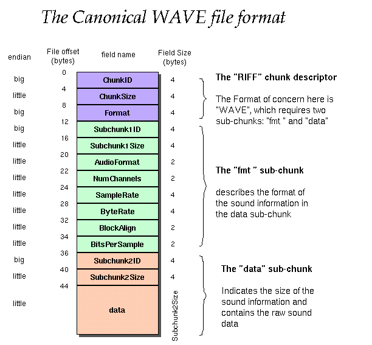

# Audio_File_Conversion
----
This Repository provides follow audio file conversion functionalities.

- pcm2wav
- wav2pcm
- delete silence
- get spectrum
- get spectrogram
- get mel-spectrogram
- get mfcc
- **Comming soon**

Most of ideas are from my team members [@sooftware](https://github.com/sooftware) and [@triplet02](https://github.com/triplet02). Thanks for great help.

----
## Audio File format
### WAVE PCM soundfile format

The WAVE file format is a subset of Microsoft's RIFF specification for the storage of multimedia files. A RIFF file starts out with a file header followed by a sequence of data chunks. A WAVE file is often just a RIFF file with a single "WAVE" chunk which consists of two sub-chunks, "fmt " and "data".



If you have any `.wav` file, you can see each real value yourslef by following process.

### "RIFF" chunk descriptor 
#### load .wav file and get header
```Python
import numpy as np

sample_rate = 16000
data = np.memmap("./sample.wav", dtype='int8',mode='r')
data = np.array(data)
wav_header = data[0:44]
```
You just read in 8-bit increments and store it to data, and get wav header. Because wav header has fixed 44 bytes, so you can easily get header by 
```Python 
data[0:44]
```
In first header, **ChunkID** contains 'RIFF' as ascii code value in Big-endian.
```Python
for i in wav_header[0:4]:
    print(chr(i),end="")
```
Result:
> RIFF

**ChunkSize** is the size of the entire file in bytes minus 8 bytes for the two files not included in this count: ChunkID and ChunkSize itself. 

It calculated also 36 + SubChunk2Size, or more precisely 4 + (8 + SubChunk1Size) + (8 + Subchunk2Size). This filed is stored as little-endian, so you need to read it using `int.from_byte()` with "little".

```python
# total size
print("Total Data size: %d bytes" % data.shape[0])

# read chunk_size and check total size - 8 byte
chunk_size = bytearray(wav_header[4:8])
print("Data size: %d bytes" % int.from_bytes(chunk_size,"little"))
```
Result:
> Total Data size: 338924 bytes
> Data size: 338916 bytes

Literally, **Format** chunk shows file format. If this file format is wave, you can see 'WAVE' in ASCII value. It's stored in big-endian.

```python
for i in wav_header[8:12]:
    print(chr(i), end="")
```
Result:
> WAVE

### "fmt " Chunk sub-chunk
The "WAVE" format consists of two subchunks: "fmt " and "data". Following is "fmt " sub-chunk.

**Subchunk1ID** is contains the letters "fmt " in big-endian. Last letter is space. You notice.

```python
for i in wav_header[12:16]:
    print(chr(i), end="")
```
Result:
> fmt 

**Subchunk1Size** is 16 for PCM. This is the size of the rest of the Subchnk which follows this number.

```python
sub_chunk1_size = bytearray(wav_header[16:20])
print("Subchunk1Size: %d" % int.from_bytes(sub_chunk1_size,"little"))
```
Result:
> Subchunk1Size: 16

**AudioFormat** chunk has 2bytes and PCM equals 1. It represents linear quantization. If values othre than 1 indicate some form of compression.

```python
audio_format = bytearray(wav_header[20:22])
print("audio_format: %d" % int.from_bytes(audio_format, "little"))
```
Result:
> audio_format: 1

**NumChannels** means number of channels. For example, mono equals 1, stereo equals 2, etc.

Following table show how multi-channel datas are compromised in data chunk.

|NumChannels|Meanning|Data struct|
|:---:|:---:|:---|
|1|mono|[data][data][data]...|
|2|stereo|[left][right][left][right]...|
|3|3 channels|[left][right][center][left][right][center]...|
|4|quad|[front left][front right][rear left][rear right]|
|5|4 channels|[left]][center][right][surround]...|
|6|6 channels|[left center][left][center][right center][right][surround]...|

```python
channel_num = bytearray(wav_header[22:24])
print("audio_format: %d" % int.from_bytes(channel_num, "little"))
```
> audio_format: 1

** SampleRate** is stored in little endian too. It means number of samples per second.

```python
sample_rate = bytearray(wav_header[24:28])
print("sample rate: %d" % int.from_bytes(sample_rate, "little"))
```

Result:
> sample rate: 16000

Some people is little confused when they first hear the **ByteRate**. It is simple. SampleRate * NumChannels * BitsPerSample/8. FYI, BitsPerSample/8 equals BytePerSample (Not ByteRate). ByteRate indicates that Bytes required to make a sound for one second.

```python
byte_rate = bytearray(wav_header[28:32])
print("byte_rate: %d" % int.from_bytes(byte_rate, "little"))
```
Result:
> byte_rate: 32000

**BlockAlign** is NumChannels * ButsPerSample/8. The number of bytes for one sample including all channels.

```python
block_align = bytearray(wav_header[32:34])
print("block_align: %d" % int.from_bytes(block_align, "little"))
```
Result:
> block_align: 2

**BitsPerSample** is like quantization resolution. 8 bits gonna 8, 16 bits gonna 16.

```python
bit_per_sample = bytearray(wav_header[34:36])
print("bit_per_sample: %d bits" % int.from_bytes(bit_per_sample, "little"))
```

> bit_per_sample: 16 bits

**Subchunk2ID** contains the letters 'data' in big-endian form.

```python
for i in wav_header[36:40]:
    print(chr(i), end="")
```
Result:
> data

**Subchunk2Size** is obviously NumSamples * NumChannels * BitsPerSample/8. This is the number of bytes in data and you can also think this as the number to be readed after this chunk.

```python
chunk_size = bytearray(wav_header[40:44])
print("sample size: %d bytes" % int.from_bytes(chunk_size, "little"))
```
Result:
> sample size: 265216 bytes


### Notes:

- The default byte ordering assumed for WAVE data file is little-endian. If file is written in big-endian, identifier is RIFX instead of RIFF.

-  Sample data must be end on an even byte boundary.
-  8-bit samples are stored as `unsigned` bytes, 0 to 255.
-  16-bit samples are stored as 2's-complement `signed` integers, -32,768 to 32,767
-  There may be additional subchunks in a WAVE data stream. If so, each will have a char[4] SubChunkID, and unsigned long SubChunkSize, and SubChunksize amount of data.
-  RIFF stands for *Resource Interchange File Format*

More detail explanation is in [here](http://soundfile.sapp.org/doc/WaveFormat/).

## File Conversion
### wav2pcm
It's simple. If you have any wave file, just read after 44 bytes.

### pcm2wav
If you know the parameter of header, you can easily make wav header with `wave` library. You can check in code wav.py.